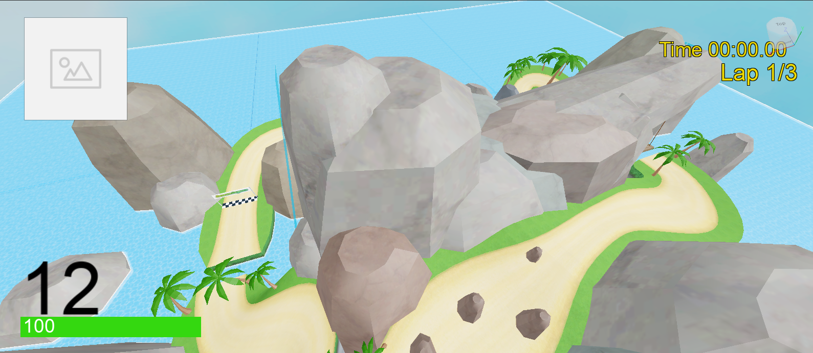

# RoBallers

RoBallers is an online multiplayer platform racing game that can be played on
Roblox at: https://www.roblox.com/games/9644420194/RoBallers

Development began in 2021 and has been on hiatus since 2023.

## Roblox Platform

Roblox is a global platform that brings people together through game playing.
It is supported on various hardware platforms from mobile phone to PC, even
game consoles like Xboxes. The game developers and players form a vabriant
community. It is estimated that there are more than 9.5 million developers on
the platform. It is also a perfect platform for learning coding and game
development.

## Features

The game is currently playable with one course and one vehicle. There are
multiple strategic items that can be given by item boxes. WASD is used to
control the vehicle, while Space Bar is used to start a drift, similar to Mario
Kart.

## How to play

### For PCs

 * Follow the link to the Game on the [Roblox website](https://www.roblox.com/games/9644420194/RoBallers)
 * Click the play button
 * Install Roblox player, if not already installed
 * Join the game automatically

### For Xboxes

Coming soon!

## How to setup for development

 * Open the directory in VS Code
 * Install Rojo plugin in VS Code
 * Use View -> Command Palette -> Rojo: Open Command option to install Roblox Studio Plugin
 * Use View -> Command Palette -> Rojo: Open Command option to start living sync on `default.project.json`
 * Open the `Roballers Project.rblx` in Roblox Studio
 * In Roblox Studio, go to plugins, select Rojo, then click Connect
 * Accept the changes from the Rojo plugin
 * Now you can modify your script in VS Code and view the changed game live in Roblox studio

## How to collaborate

Once you have made some changes,

 * Commit the script changes into your local repo
 * If you modified anything other than the script, save and commit the project to the `Roballer Project.rblx`
 * Push the repo into your own fork of the repo
 * Open a PR with detailed information about your change

I will review, and merge it once approved. Once merged, I will publish to the
Roblox Platform within 24 hours.
